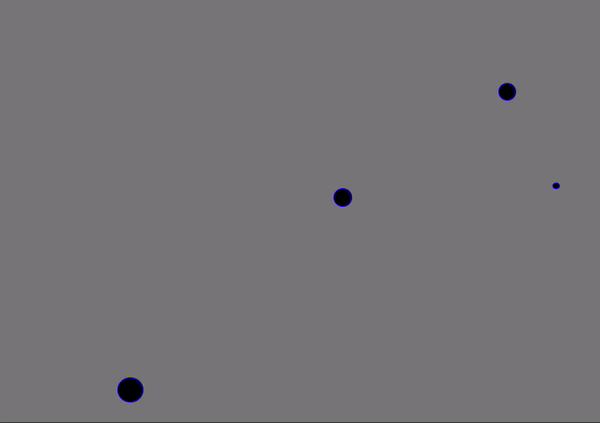

## What is this Project?
> This is an N-body simulator, which is supposed to simulate the behavior of a multi-particle system governed by gravitational forces

The algorithm runs in O(n^2) time, and was made by using the Python library **Graphics.py**

## The Implementation
I created a class of Particles, which is initiated by generating an array of Particles. Each particle has a position, velocity, and acceleration in both x and y space. The initial positions and velocities are generated by a normal distribution which is itself parameterized by constants. The Particle class is represented as such: 
```
class Particle:
    def __init__(self):
        self.x = np.random.uniform(0, WIDTH, 1)[0]
        self.vx = np.random.uniform(-VEL, VEL, 1)[0]
        self.y = np.random.uniform(0, HEIGHT, 1)[0]
        self.vy = np.random.uniform(-VEL, VEL, 1)[0]
        self.ax = 0
        self.ay = 0
        self.mass = np.random.uniform(MASS, MASS * 5, 1)[0]
        self.size = self.mass / MASS * SIZE
```

When you run the program, you can get some pretty interesting behavior. Here are some examples of the interactions:




## Limitations and Next Steps
While I was able to generate the proper vector math simulate the n-body interactions in two dimensions with relative accuracy, there were a few areas where this project fell short
1. This algorithm runs in 0(n^2) time, meaning that the force on each particle is calculated by calculating the superposition of forces on that particle. I would next like to implement the [Barnes-Hut Algorithm](https://en.wikipedia.org/wiki/Barnes%E2%80%93Hut_simulation), which calculates the forces on each particle by generating an approximation only using particles nearby.
2. The behavior of the particles in very close proximity is erratic. When the distance between two particles gets very small, the acceleration becomes very large, and the particles can zip by one another
3. I'd like to try and implement a system where there would be a supermassive body (or two) located near the center of the display.


